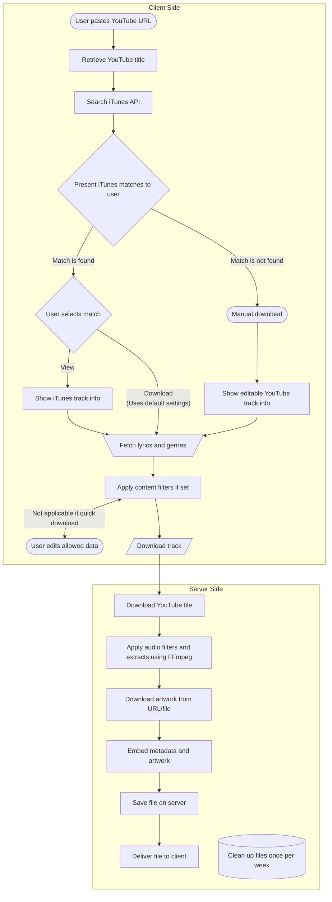

## ➡️ Your Audio Download Workflow

Understanding the workflow is key to getting the best results. Our application bridges the gap between YouTube's vast video library and iTunes' rich music metadata, giving you perfectly tagged and formatted audio files.

### 🚶 Step-by-Step Guide

1. **Configure**: Before searching, customize your preferences in the settings page. You can choose the output file extension, sample rate, artwork size, and lyrics options. Settings are saved in browser and can be exported to _JSON_
2. **Paste YouTube URL**: Begin search by pasting any valid YouTube video link into the URL input field.
3. **Automatic Title Retrieval**: The application extracts the video title from YouTube. This title is then used as the primary query for the iTunes API.
4. **iTunes Metadata Search**: The system performs a smart search against the iTunes catalog to find matching songs or albums. It prioritizes official releases to ensure accuracy.
5. **Select Best Match**: You will be presented with a list of potential matches from iTunes. It is crucial to select the correct entry that corresponds to your desired song. This selection dictates the album art, artist, album name, genre, and track number that will be embedded into your final audio file.
6. **Configure metadata**: Fetch and embed lyrics, genres and comment.  
7. **Download & Process**: Once configured, click the "Download" button. The application will:
   - Extract the highest quality audio stream from the YouTube video.
   - Convert it to your selected format and sample rate (using FFmpeg).
   - Embed the chosen iTunes metadata (album art, tags).
   - Deliver your perfectly prepared audio file.

### Graph

